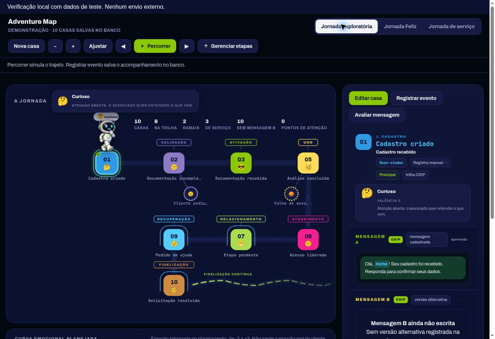

# Chaiane de Paula | Portfólio de produtos de tecnologia

Projetos que conectam experiência do cliente, suporte conversacional e implantação de sistemas.

Sou Chaiane de Paula, a Chai. Este espaço apresenta quatro produtos em desenvolvimento: os problemas que resolvem, as funcionalidades implementadas e as evidências disponíveis. O código completo é mantido em repositórios separados, com acesso restrito.

## Conheça os projetos

| Projeto | Problema que aborda | Entrega demonstrável |
| --- | --- | --- |
| [CXIP](projetos/CXIP.md) | Visualizar e governar a jornada conversacional | Mapa interativo, mensagens vinculadas, histórico e registros persistentes |
| [Nexora](projetos/NEXORA.md) | Acompanhar implantações e suas pendências | Carteira de clientes, entregas, dependências e indicadores |
| [chAI](projetos/CHAI.md) | Orientar clientes e organizar pedidos de suporte | Assistente local em Python com abertura de chamados |
| [Orbytta](projetos/ORBYTTA.md) | Conectar a gestão da implantação à operação do cliente | Administração, acompanhamento, chamados e demonstração de operação |

## Meu foco

- Transformar necessidades de atendimento e implantação em fluxos de produto.
- Organizar comunicações, etapas, tarefas e critérios de conclusão.
- Construir protótipos e evoluí-los para aplicações com dados persistentes.
- Documentar decisões, verificar comportamentos e apresentar limitações com clareza.

## Destaque: o mapa da jornada do CXIP

A imagem mostra uma verificação local com dados inventados. Não contém informações de clientes reais nem comprova integração com um canal externo.

## Para gestores e recrutadores

Cada página descreve o problema, as entregas verificadas e uma sugestão de demonstração em entrevista. As versões estão em desenvolvimento e não são apresentadas como produtos completos certificados.

Demonstrações autenticadas ou locais podem ser apresentadas em entrevista. Este portfólio não concede acesso a dados operacionais, contas pessoais ou código privado.

**Contato:** [perfil profissional no GitHub](https://github.com/chaigdp).

Atualizado em 30 de setembro de 2026.
