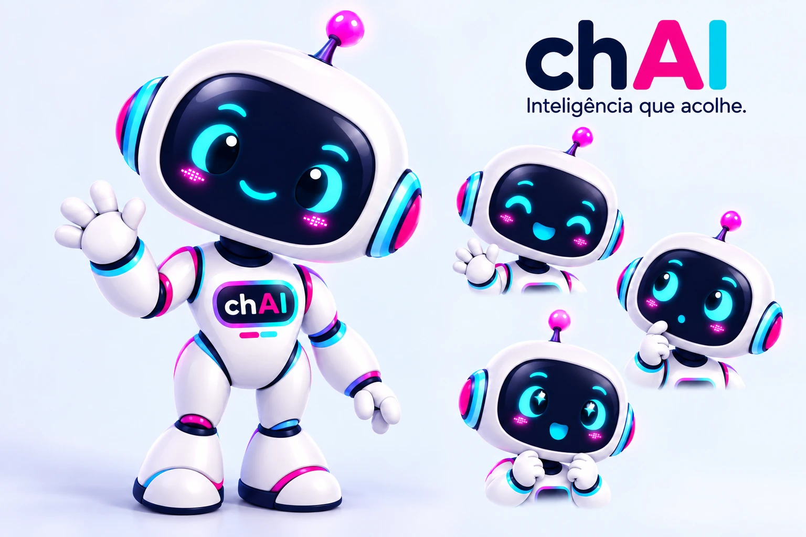

# chAI | Inteligência que acolhe

[Voltar ao portfólio](../README.md)

A chAI é a mascote e agente do ecossistema chAi. Sua identidade representa tecnologia acessível, inteligência gentil, clareza e presença humana.

**Conversas que movem, relações que ficam.**

## Personalidade

A mascote deve comunicar:

- gentileza;
- clareza;
- curiosidade;
- inteligência;
- segurança;
- elegância em situações de conflito;
- capacidade de orientar sem infantilizar a experiência.

## Paleta

| Cor | Código | Aplicação |
| --- | --- | --- |
| Branco perolado | #F8F9FF | Carcaça |
| Azul-marinho | #080F3D | Tela e contornos |
| Ciano | #00CFE8 | Olhos e detalhes |
| Rosa | #FF0099 | Bochechas e detalhes |
| Roxo | #7938E8 | Antena e detalhes |
| Lavanda | #CCD0E8 | Sombras |

## Poses vetoriais oficiais

[Acenando](../assets/mascote/chAI_Acenando.svg) · [Apresentando](../assets/mascote/chAI_Apresentando.svg) · [Pensando](../assets/mascote/chAI_Pensando.svg) · [Celebrando](../assets/mascote/chAI_Celebrando.svg)

Os SVGs são os arquivos oficiais usados no portfólio. A referência rasterizada pode ser mantida como material visual, mas não substitui os vetores oficiais.

## Uso

A mascote pode aparecer em:

- orientação dentro dos sistemas;
- mensagens de contexto;
- apresentação de recursos;
- estados vazios;
- ajuda e suporte;
- celebração de conclusão;
- comunicação institucional do ecossistema.

O uso deve ter função clara na experiência. Evitar excesso, infantilização ou uso puramente decorativo em telas densas.

Atualizado em **06/10/2026**.
