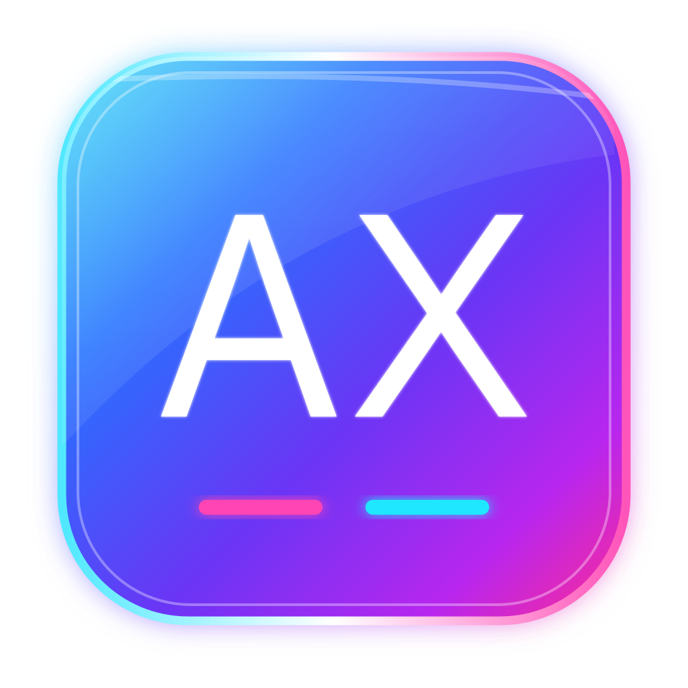

# Axis | Gestão do ecossistema

[Voltar ao portfólio](../README.md)

## Centralizar para enxergar melhor

O Axis é a camada de gestão dos projetos e sistemas do ecossistema chAi.

A proposta é reunir em um só lugar informações que normalmente ficam espalhadas entre links, documentos, ambientes, pendências e conversas.

## Escopo

- cadastro de projetos e sistemas;
- links de ambientes e demonstrações;
- acompanhamento de pendências;
- organização de documentação e arquivos;
- histórico de decisões e prompts;
- visão executiva do estado de cada produto;
- apoio à governança do ecossistema.

## Papel no ecossistema

Enquanto Vectta organiza implantações, Noryn organiza relacionamento, chAI GO organiza operação conversacional e Aurion organiza jornadas, o Axis funciona como uma visão central de gestão dos próprios produtos.

O nome **Fluxion** não faz parte do ecossistema ativo atual.

## Estado

Produto em evolução. A documentação e a organização dos módulos seguem sendo refinadas conforme os demais sistemas avançam.

Atualizado em **06/10/2026**.
