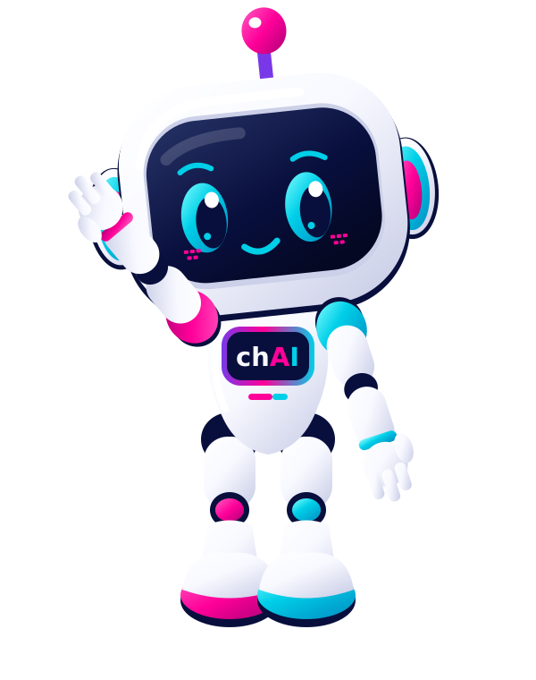

# chAI 0.3 | Inteligência conversacional

[Voltar ao portfólio](../README.md)

**Conversas que movem, relações que ficam.**

## Problema

Clientes precisam de orientação com contexto e continuidade quando o atendimento passa à equipe.

## Minha proposta de produto

Unir assistente, conhecimento, histórico e atendimento humano em um canal web.

## Entregas atuais

- Painel executivo, fila de atendimento humano e cadastro/desativação de usuários.
- Conhecimento editável e copiloto com fontes consultadas.
- Construtor de fluxos com rascunho e publicação.
- Histórico retomável, preferências autorizadas, satisfação e nova mascote.

## Demonstração

1. Iniciar o servidor em ambiente privado e entrar com conta previamente criada.
2. Conversar com a assistente e verificar uma fonte.
3. Encaminhar à equipe e acompanhar na central executiva.

## Tecnologia e evidências

Python, HTML, CSS, JavaScript e SQLite; adaptador para IA externa.

O repositório contém testes de autenticação, isolamento, atendimento humano, fluxos, memória com consentimento e conexão Axis. Esta atualização do portfólio conferiu a documentação; não reexecutou as suítes dos produtos.

## Estado e próximos passos

Atualização do painel por consulta a cada cinco segundos. IA externa depende de configuração privada. WhatsApp, Instagram, Blip, e-mail e ações no ERP não estão conectados. Execução local ou porta privada; sem escala de produção comprovada.

A nova mascote aparece como rosto da agente. [Conheça sua identidade](../docs/MASCOTE.md).

[Código e documentação](https://github.com/chaigdp/chai)

Dados de demonstração são fictícios. Atualizado em 01/10/2026.
