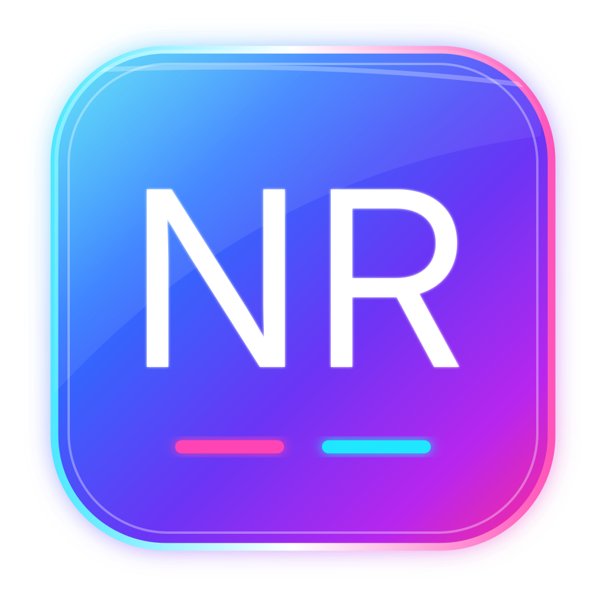

# Noryn | CRM conversacional

[Voltar ao portfólio](../README.md)

## Relacionamento com contexto

O Noryn é o CRM do ecossistema chAi, pensado para empresas que vendem, atendem e mantêm relacionamento por conversa.

A proposta é evitar que contatos, oportunidades, tarefas e histórico fiquem separados da experiência conversacional.

## Núcleo do produto

- contatos e organizações;
- prevenção e tratamento de duplicidades;
- funis e oportunidades;
- tarefas e linha do tempo;
- etiquetas e campos personalizados;
- visões salvas e priorização do que fazer agora;
- importação e exportação;
- automações simples;
- relatórios essenciais;
- base legal, solicitações do titular e anonimização para LGPD.

## Integração com o ecossistema

O Noryn foi concebido para compartilhar contexto com o chAI GO e com a chAI.

Isso permite que uma operação conversacional consulte histórico, oportunidades, chamados, pendências e dados do relacionamento sem obrigar o atendente a reconstruir o contexto manualmente.

A arquitetura também considera integração com sistemas próprios dos clientes.

## Segurança

O projeto utiliza autenticação em duas etapas para perfis sensíveis, isolamento entre empresas no banco de dados, papéis de acesso, auditoria e políticas de proteção de dados.

## Estado

O núcleo de API e regras de negócio está em evolução avançada. A interface completa é uma etapa posterior do produto.

Atualizado em **06/10/2026**.
